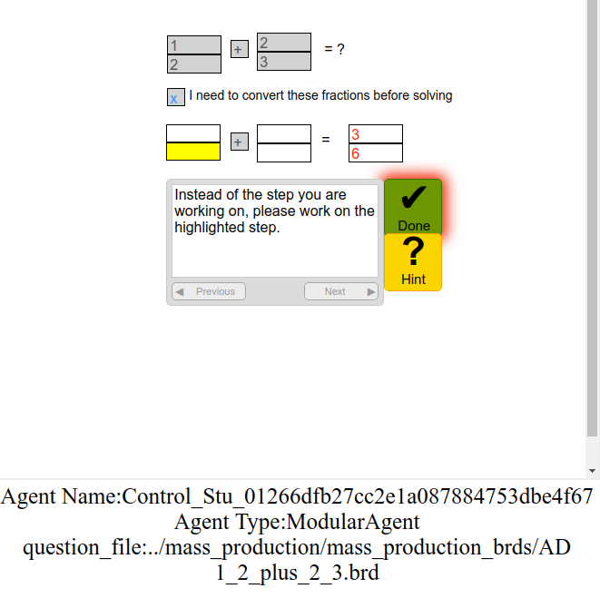

# Apprentice / AL_Core

[](https://hq-git.soartech.com/apprentice/apprentice/commits/master)

[](https://apprentice.hq-git.soartech.com/apprentice/coverage/)

The Apprentice Learner API, this library implement a general interface for
training agents via demonstration and feedback.

# Installation
There are two main GitHub repositories for working with AL. We will general refer to these as apprentince_learner_api (https://github.com/apprenticelearner/apprentice_learner_api), which is the core library, and AL_HTML (https://github.com/apprenticelearner/AL_HTML), which contains code for interfacing AL with CTAT-HTML tutors.

To get started, clone both repositories to your machine either by using the Github desktop application or by running the following commands in a terminal / command line:

```bash
git clone https://github.com/apprenticelearner/apprentice_learner_api
git clone https://github.com/apprenticelearner/AL_HTML
```

Navigate to the apprentice_learner_api directory in a terminal / command line and run:

```bash
python3 -m pip install -r requirements.txt 
```

If you receive a permission error from that command try running:

```bash
python3 -m pip install -r requirements.txt --user
```

**If you are on Windows**, you may need to install pytorch separately. 
We recommend downloading the relevant .whl file (mostly likely torch‑1.0.1‑cp37‑cp37m‑win_amd64.whl) from here: https://www.lfd.uci.edu/~gohlke/pythonlibs/#pytorch. Navigate a terminal to where you downloaded the file and instal with:

```bash
python3 -m pip install torch‑1.0.1‑cp37‑cp37m‑win_amd64.whl
```

If you are running python from within an environment like pyzo you may have to run these install command in a native terminal rather than the one built into pyzo for it to work.

Once you have installed all of the required modules, navigate your terminal to the apprentice_learner_api directory and run the following:

```bash
python3 manage.py migrate
````

# Basic Tests
These are a number of basic tests that are mainly useful for checking that everything has been installed correctly.

## Batch Training Example
Batch training is used to provide AL agents with a predefined set of training problems that they will learn from. When training agents using this approach, you do not need to manually provide it with examples. Agents are trained using previously created practice problems. Specifically, we support the use of example tracing behavior graphs for training agents (BRD files output by CTAT for use with CTAT interfaces). This approach has been applied to model human behavior in previously authored tutoring systems from prior studies. It has also been applied to compare different tutoring systems (e.g., that present fractions training in different ways) to see which best support human learning. Finally, batch training has been employed to test different theories of how people learn—through comparison of model behavior and human behavior.

To see an example of how batch training works, naviage to the AL_HTML repo and then navigate to  ```/examples/FracPreBake/FractionArithmetic```. Then run:

```bash
python3 ../../../train.py control_training.json
```

You may be prompted to specify the location of the AL repo the first time you run train.py (if you screw this up you can change it in net.conf which will exist in the AL_HTML directory after running train.py at least once)

*If at this point an error pops up complaining about “picklefield” navigate to the ```apprentice_learner_api/src/django-picklefield``` folder and run ```python setup.py install```

After running train.py on control_training.json, you should see the following user interface open in your web browser:

<p align="center">

</p>
 

The agent will attempt to take action in the interface, receive feedback based on the tutoring model represented by the BRD file that is loaded (specified at the bottom) and work through the problems. 

One error that we encountered when preparing this manual was due to an ad blocker preventing the tutoring interface from properly loading in the browser. If the interface shown above does not seem to load in your browser and you have an ad blocker, then try disabling it.

To get a better sense of how the batch training operates, open up the file `control_training.json` in your text editor. You will see something like this:

```json
{
  "training_set1": [
    {
      "agent_name": "Control_Stu_01266dfb27cc2e1a087884753dbe4f67",
      "agent_type": "ModularAgent",
      "stay_active": true,
      "dont_save": true,
      "no_ops_parse": true,
      "args": {
        "when_learner": "trestle",
        "where_learner": "MostSpecific",
        "planner": "fo_planner"
      },
      "feature_set": ["equals"],
      "function_set": ["add","subtract","multiply","divide"],
      "problem_set": [
        {
          "set_params": {
            "HTML": "HTML/fraction_arithmetic.html",
            "examples_only": false
          }
        },
        {"question_file": "../mass_production/mass_production_brds/M 1_2_times_2_3.brd"},
        {"question_file": "../mass_production/mass_production_brds/M 1_3_times_1_6.brd"},
        {"question_file": "../mass_production/mass_production_brds/M 1_3_times_3_2.brd"}
      ]
    }
  ]
}

```
In general the JSON script passed to the train.py script as an argument specifies what agent to use for the training (ModularAgent in this example), how the agent should be configured (in this example it uses the TRESTLE algorithm for when learning, MostSpecific for its where learning algorithm, equals as a feature, and add, subtract, multiply, and divide as functions that it can apply). Finally, the agent is trained using several practice problems. Each practice problem in the JSON file has an HTML file to use for the interface and a BRD file to specify the behavior of the tutor. The BRD file specifies the initial problem state for the interface and an example tracing model of all the correct solution paths, which are used to provide an agent with correctness feedback and worked examples. 

*The full JSON script specifications can be found [here](https://github.com/apprenticelearner/AL_HTML/wiki/Training.json-Specifications)

## Interactive Training Example
Another approach to training an agent is to manually provide it with problems to solve and then to interactively tutor it in solving these problems. This approach to training has been employed as a means of authoring models for intelligent tutoring systems. Specifically, an educational technology designer can train an agents similar to how they would train another person—by providing problems, examples, and feedback. In response, the agent learns rules that can then be used within an intelligent tutoring system to provide one-on-one feedback to students for arbitrary practice problems. 

To see this interactive training approach in action, run the following command:

```bash
python3 train.py free_author.json --interactive --foci
```

You should be presented with the same interface you saw in the batch training example. However, now it should prompt you for a problem to solve, to demonstrate solution steps, and to provide correctness feedback on the agents actions.

If you inspect free_author.json, you will see that it has a similar format to the training.json file used for batch training. It contains specifications for the agent to use, the configuration of this agent, and the interface to load. **Note, if you modify this file and rerun the script, Chrome will sometimes cache the file and so your changes will not be loaded.** To overcome this, rename the file to something else (e.g., free_author2.json) and pass this to the train.py script instead. 

There are many options that can be specified when training agents. For example, the “--nools” flag allows you to specify a directory where the knowledge learned by an AL agent will be exported into nools rules. Additionally, if you apply the “--foci” flag, then you are required to provide additional guidance to AL agents by specifying a subset of the fields that are relevant for ALs learning, directing its focus of attention and potentially speeding up learning. 

## Tic Tac Toe Example
This example is a simple command line app where you can train a single agent to take legal Tic Tac Toe moves against itself. One of the main benefits of this example is the ability to try out different types of agents and confirm they all work without errors.

Navigate to the apprentice_learner_api directory and run:

```bash
python3 tic-tac-toe-example.py
```

Follow the on screen prompts to train the agent to take moves.

To try out different types of agents you can provide a different value for the -agent argument:

```bash
python3 tic-tac-toe-example.py -agent Modular
```


# Papers and Other Documentation
1. Chris’s Thesis [link](http://christopia.net/thesis) specifically Chapter 3
    * Probably the best current source on the framework in writing
2. The Apprentice Learner Architecture EDM paper [link](http://erikharpstead.net/papers/C9%20-%20MacLellan%20et%20al.%20-%202016%20-%20Apptentice%20Learner%20Architecture%20EDM%20Conference.pdf)
    * The best published reference, but the model diagram in this one is outdated
3. The TRESTLE Algorithm [link](http://erikharpstead.net/papers/J1%20-%20MacLellan%20et%20al.%20-%202016%20-%20TESTLE%20-%20ACS%20Journal.pdf)
    * Describes TRESTLE
4. TRESTLE docs [link](https://concept-formation.readthedocs.io/en/latest/)
    * The documentation for the actual TRESTLE software library, these are generally more accurate than the published papers but nothing has substantially changed (e.g., we technically calculate category utility differently now but in a way that produces the exact same behavior with less computation)
    * This is also useful to check out because we use the preprocessors from this library throughout the apprentice to do things like flatten states for processing.
5. The Django Docs [link](https://docs.djangoproject.com/en/1.10/)
Useful for working with the Django parts of the implementation
    * This link will take you to the version of Django that is listed as a requirement for the library
6. Py Search Docs [link](https://py-search.readthedocs.io/en/latest/)
    * The search library that Chris wrote that is used throughout the apprentice/trestle

